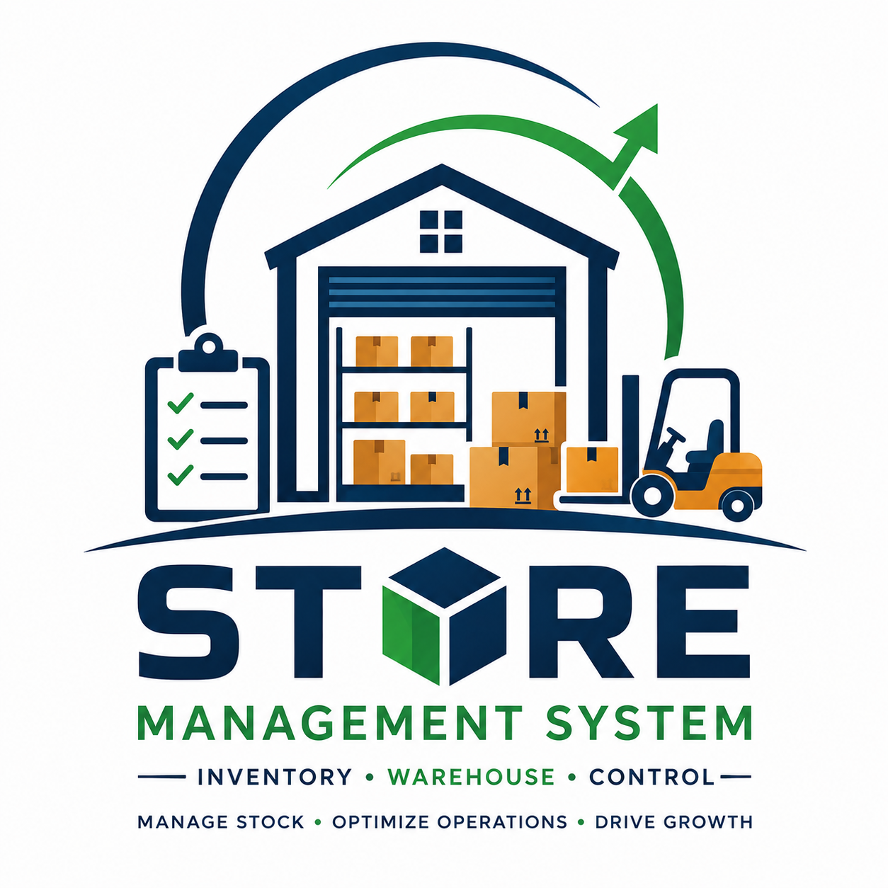

<p align="center">
  
</p>
<br />
<h1 align="center">Store Management System</h1>

<p align="center">
Enterprise-grade Store Management Platform built with
<strong>FastAPI</strong>, <strong>React</strong>, and <strong>MySQL</strong>
</p>

<p align="center">


</p>

---

# Overview

Store Management System is a modern enterprise application designed for managing retail stores, inventory, users, security, purchasing, sales, and reporting.

The project follows a modular architecture that supports future expansion without major redesign.

The application is designed with:

- Enterprise Security
- Modular Architecture
- RBAC (Role Based Access Control)
- REST APIs
- Responsive User Interface
- High Performance
- Easy Maintenance

---

# Technology Stack

## Backend

- Python 3.13
- FastAPI
- SQLAlchemy 2.x
- Alembic
- MySQL 8.4
- JWT Authentication
- Pydantic

---

## Frontend

- React 19
- Vite
- Material UI
- Axios
- React Router

---

## Database

- MySQL Community Server 8.4

---

# Current Features

## Authentication

- Login
- JWT Authentication
- Protected Routes

---

## Platform

- Platform Module Management

---

## Security

- Role Management

---

## Coming Soon

- Dynamic RBAC
- Permission Management
- Role Permission Assignment
- User Management
- User Role Assignment

---

## Inventory

- Product Categories
- Products
- Warehouses
- Stock Management

---

## Purchasing

- Suppliers
- Purchase Orders
- Goods Receipt

---

## Sales

- Customers
- Sales Orders
- Billing

---

## Reports

- Dashboard
- Sales Reports
- Inventory Reports
- Audit Logs

---

# Project Structure

```
store-management/
│
├── backend/
│   ├── alembic/
│   ├── app/
│   ├── scripts/
│   ├── requirements.txt
│   └── README.md
│
├── frontend/
│   ├── public/
│   ├── src/
│   ├── package.json
│   └── README.md
│
├── database/
│
├── docs/
│
├── scripts/
│
├── .gitignore
│
└── README.md
```

---

# Backend Architecture

```
API
 │
 ▼
Services
 │
 ▼
Repositories
 │
 ▼
Models
 │
 ▼
MySQL
```

---

# Frontend Architecture

```
Pages

     │

Components

     │

Hooks

     │

Services

     │

REST API

     │

FastAPI Backend
```

---

# Security Architecture

```
Users

   │

User Roles

   │

Roles

   │

Role Permissions

   │

Permissions

   │

Pages

   │

Platform Modules
```

This architecture allows dynamic permission assignment without modifying application code.

---

# Installation

## Backend

```bash
cd backend

python -m venv venv

source venv/bin/activate

pip install -r requirements.txt

alembic upgrade head

uvicorn app.main:app --reload
```

---

## Frontend

```bash
cd frontend

npm install

npm run dev
```

---

# API Documentation

After starting the backend:

```
http://localhost:8000/docs
```

Swagger UI provides interactive API documentation.

---

# Roadmap

## Phase 1

- Authentication
- Platform Modules
- Role Management

---

## Phase 2

- Dynamic RBAC
- Permission Management
- User Management

---

## Phase 3

- Inventory

---

## Phase 4

- Purchasing

---

## Phase 5

- Sales

---

## Phase 6

- Reports & Dashboard

---

# Screenshots

```
docs/screenshots/
```

Future screenshots:

- Login
- Dashboard
- Platform Modules
- Role Management
- Permission Management
- Products
- Reports

---

# Documentation

Project documentation will be maintained inside:

```
docs/
```

Including:

- Architecture
- Database Design
- API Guide
- Deployment Guide
- User Manual

---

# Contributing

Contributions, suggestions, and improvements are welcome.

Please create a feature branch before submitting pull requests.

---

# Author

**Venkatesh Ramalingam**

Network & Infrastructure Engineer

Building an Enterprise Store Management System using FastAPI and React.

---

# License

This project is licensed under the MIT License.
